# Integration Data Flow Diagrams

This document provides detailed data flow diagrams for each external tool integration.

---

## 1. Todoist Integration Flow

### Task Creation Flow


### Bidirectional Sync Flow


### Conflict Resolution Flow


---

## 2. Gmail Integration Flow

### Email Processing Pipeline


### Smart Email Classification


### Notification Flow


---

## 3. Google Keep Integration Flow

> ⏸️ **STATUS: DEFERRED** - Google Keep integration is on hold due to lack of official API. Use Todoist or WhatsApp for quick capture instead.

### Chrome Extension Capture Flow (Deferred)


### Periodic Sync Flow


### Alternative: Google Tasks API (Also Deferred)

> ⏸️ **NOT IMPLEMENTED** - Todoist already handles task management. Google Tasks integration is not needed.

**Rationale:**
- Todoist provides superior task management (Phase 4 - implemented)
- WhatsApp MCP handles quick capture (Phase 10 - implemented)
- Google Tasks would create redundant functionality
- Complexity not justified for Life-OS use case

---

## 4. Chrome Bookmarks Integration Flow

### Real-time Bookmark Sync


### Folder Structure Mapping


### Bookmark Search & Retrieval


---

## 5. WhatsApp Message Management Flow

> ✅ **IMPLEMENTED** - Uses WhatsApp MCP server with Life-OS skill wrapper (Week 10).

**Note**: This section replaces the original Telegram bot integration. WhatsApp MCP provides equivalent functionality with simplified architecture.

### Command Processing Flow (via WhatsApp MCP)

```mermaid
sequenceDiagram
    participant U as User
    participant WA as WhatsApp
    participant MCP as WhatsApp MCP
    participant SK as Life-OS Skill
    participant CS as Claude Skills
    participant TD as Todoist

    U->>WA: /task "Buy milk"
    WA->>MCP: Message Received
    MCP->>SK: Parse Command
    SK->>SK: Validate Command
    SK->>CS: Create Task
    CS->>TD: Sync to Todoist
    TD-->>CS: Task Created
    CS-->>SK: Success
    SK->>MCP: Format Response
    MCP->>WA: Send Confirmation
    WA-->>U: ✅ Task created!
```



**Key Differences from Telegram:**
- No webhook infrastructure needed
- Authentication handled by MCP
- Skill wrapper coordinates via MCP tools
- Simpler deployment and maintenance

### Quick Capture Flow (Simplified with WhatsApp MCP)


**Advantages:**
- No bot registration required
- No webhook setup
- MCP handles authentication
- Skill-based command parsing
- Portable across MCP-enabled environments

### Daily Briefing Flow (Morning & Evening Routines)

```mermaid
sequenceDiagram
    participant CRON as Schedule (5:30 AM / 8:30 PM)
    participant SK as Life-OS Skill
    participant CS as Claude Skills
    participant MCP as WhatsApp MCP
    participant U as User

    Note over CRON: Morning Briefing (5:30 AM)
    CRON->>SK: Trigger Morning Routine
    SK->>CS: Fetch Today's Tasks
    SK->>CS: Fetch Active Goals
    SK->>CS: Fetch Habit Reminders
    CS-->>SK: Compiled Data
    SK->>SK: Format Briefing
    SK->>MCP: Send Message
    MCP-->>U: 🌅 Good morning! Here's your day...

    Note over CRON: Evening Review (8:30 PM)
    CRON->>SK: Trigger Evening Routine
    SK->>CS: Fetch Completed Tasks
    SK->>CS: Fetch Tomorrow's Preview
    CS-->>SK: Compiled Data
    SK->>SK: Format Review
    SK->>MCP: Send Message
    MCP-->>U: 🌙 Great work today! Tomorrow: ...

    U->>MCP: /habits log
    MCP->>SK: Process Command
    SK->>CS: Update Habit Tracking
    CS-->>SK: Saved
    SK->>MCP: Format Response
    MCP-->>U: ✅ Habits logged!
```



### Multi-Device Sync (via WhatsApp MCP)


**Simplified Architecture:**
- WhatsApp handles multi-device sync natively
- No custom WebSocket server needed
- Memory files are the source of truth
- External tools sync bidirectionally
- WhatsApp MCP broadcasts responses to all devices

---

## 6. Unified Integration Architecture

### Central Hub Data Flow


**Key Changes from Original:**
- Google Keep marked as deferred
- Telegram replaced with WhatsApp MCP
- Gmail/Calendar via Google Workspace MCP (no webhooks)
- Memory files as central storage (not PostgreSQL)
- Simplified architecture for local-only operation

### Event-Driven Architecture


### Sync State Machine


### Error Handling Flow


---

## 7. Security & Privacy Flows

### Authentication Flow


### Data Encryption Flow

```mermaid
graph LR
    A[Plain Text Data] --> B[Encryption Service]
    B --> C{Encryption Method}

    C -->|At Rest| D[AES-256]
    C -->|In Transit| E[TLS 1.3]
    C -->|Credentials| F[Keychain API]

    D --> G[Encrypted Storage]
    E --> H[HTTPS Request]
    F --> I[System Keychain]

    G --> J[Backup Service]
    J --> K[Encrypted Backup]
```

### Audit Logging Flow

```mermaid
sequenceDiagram
    participant U as User
    participant A as Application
    participant L as Audit Logger
    participant DB as Log Database
    participant M as Monitoring

    U->>A: Perform Action
    A->>L: Log Event
    L->>L: Add Metadata
    L->>L: Add Timestamp
    L->>DB: Store Log
    DB-->>L: Confirmed

    alt Suspicious Activity
        L->>M: Alert
        M->>A: Flag for Review
    end
```

---

## Performance Optimization

### Caching Strategy

```mermaid
graph TD
    A[Request] --> B{Cache Hit?}
    B -->|Yes| C[Return Cached]
    B -->|No| D[Fetch from API]

    D --> E[Update Cache]
    E --> F[Set TTL]
    F --> G[Return Data]

    H[Background Job] -->|Invalidate| I{Condition?}
    I -->|Updated| J[Clear Cache]
    I -->|Expired| J
    I -->|Manual| J
```

### Batch Processing

```mermaid
sequenceDiagram
    participant A as Application
    participant Q as Queue
    participant B as Batch Processor
    participant API as External API

    loop Continuous
        A->>Q: Add Item
    end

    Note over B: Every 5 minutes
    B->>Q: Get Batch (100 items)
    Q-->>B: Items
    B->>API: Batch API Call
    API-->>B: Results
    B->>B: Process Results
    B->>Q: Mark Complete
```

---

## Monitoring & Observability

### Metrics Collection Flow

```mermaid
graph TB
    A[Integration Event] --> B[Metrics Collector]
    B --> C[Prometheus]
    B --> D[Custom Metrics]

    C --> E[Grafana Dashboard]
    D --> E

    E --> F{Threshold Exceeded?}
    F -->|Yes| G[Alert Manager]
    F -->|No| H[Continue Monitoring]

    G --> I[Send Notification]
    I --> J[Slack]
    I --> K[Email]
    I --> L[PagerDuty]
```

These diagrams provide a comprehensive view of how data flows through each integration, helping developers understand the system architecture and troubleshoot issues effectively.
