# Integration Data Flow Diagrams

This document provides detailed data flow diagrams for each external tool integration.

---

## 1. Todoist Integration Flow

### Task Creation Flow


### Bidirectional Sync Flow


### Conflict Resolution Flow


---

## 2. Gmail Integration Flow

### Email Processing Pipeline


### Smart Email Classification


### Notification Flow


---

## 3. Google Keep Integration Flow

### Chrome Extension Capture Flow


### Periodic Sync Flow


### Alternative: Google Tasks API


---

## 4. Chrome Bookmarks Integration Flow

### Real-time Bookmark Sync


### Folder Structure Mapping


### Bookmark Search & Retrieval


---

## 5. Telegram Integration Flow

### Command Processing Flow


### Quick Capture Flow


### Interactive Callback Flow

```mermaid
sequenceDiagram
    participant CS as Claude Skills
    participant T as Telegram Bot
    participant U as User

    Note over CS: Task Due Reminder
    CS->>T: Send Notification with Keyboard
    T-->>U: 📋 Task: Buy groceries

    Note over U: Shows Inline Keyboard
    U->>T: Click "✅ Mark Done"
    T->>CS: callback_query: complete:task123
    CS->>CS: Mark Task Complete
    CS-->>T: Answer Callback
    T-->>U: ✅ Task completed!
```



### Multi-Device Sync


---

## 6. Unified Integration Architecture

### Central Hub Data Flow


### Event-Driven Architecture


### Sync State Machine


### Error Handling Flow


---

## 7. Security & Privacy Flows

### Authentication Flow

```mermaid
sequenceDiagram
    participant U as User
    participant A as Life-OS App
    participant V as Credential Vault
    participant S as External Service

    U->>A: Access Feature
    A->>V: Request Token
    V->>V: Check Expiry

    alt Token Valid
        V-->>A: Return Token
        A->>S: API Call
        S-->>A: Success
    else Token Expired
        V->>S: Refresh Token
        S-->>V: New Token
        V->>V: Store Token
        V-->>A: Return Token
        A->>S: API Call
    else No Token
        V-->>A: No Credentials
        A->>U: Prompt Auth
        U->>S: OAuth Flow
        S-->>A: Auth Code
        A->>S: Exchange for Token
        S-->>A: Access Token
        A->>V: Store Token
    end
```

### Data Encryption Flow

```mermaid
graph LR
    A[Plain Text Data] --> B[Encryption Service]
    B --> C{Encryption Method}

    C -->|At Rest| D[AES-256]
    C -->|In Transit| E[TLS 1.3]
    C -->|Credentials| F[Keychain API]

    D --> G[Encrypted Storage]
    E --> H[HTTPS Request]
    F --> I[System Keychain]

    G --> J[Backup Service]
    J --> K[Encrypted Backup]
```

### Audit Logging Flow

```mermaid
sequenceDiagram
    participant U as User
    participant A as Application
    participant L as Audit Logger
    participant DB as Log Database
    participant M as Monitoring

    U->>A: Perform Action
    A->>L: Log Event
    L->>L: Add Metadata
    L->>L: Add Timestamp
    L->>DB: Store Log
    DB-->>L: Confirmed

    alt Suspicious Activity
        L->>M: Alert
        M->>A: Flag for Review
    end
```

---

## Performance Optimization

### Caching Strategy

```mermaid
graph TD
    A[Request] --> B{Cache Hit?}
    B -->|Yes| C[Return Cached]
    B -->|No| D[Fetch from API]

    D --> E[Update Cache]
    E --> F[Set TTL]
    F --> G[Return Data]

    H[Background Job] -->|Invalidate| I{Condition?}
    I -->|Updated| J[Clear Cache]
    I -->|Expired| J
    I -->|Manual| J
```

### Batch Processing

```mermaid
sequenceDiagram
    participant A as Application
    participant Q as Queue
    participant B as Batch Processor
    participant API as External API

    loop Continuous
        A->>Q: Add Item
    end

    Note over B: Every 5 minutes
    B->>Q: Get Batch (100 items)
    Q-->>B: Items
    B->>API: Batch API Call
    API-->>B: Results
    B->>B: Process Results
    B->>Q: Mark Complete
```

---

## Monitoring & Observability

### Metrics Collection Flow

```mermaid
graph TB
    A[Integration Event] --> B[Metrics Collector]
    B --> C[Prometheus]
    B --> D[Custom Metrics]

    C --> E[Grafana Dashboard]
    D --> E

    E --> F{Threshold Exceeded?}
    F -->|Yes| G[Alert Manager]
    F -->|No| H[Continue Monitoring]

    G --> I[Send Notification]
    I --> J[Slack]
    I --> K[Email]
    I --> L[PagerDuty]
```

These diagrams provide a comprehensive view of how data flows through each integration, helping developers understand the system architecture and troubleshoot issues effectively.
