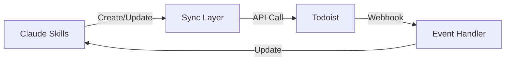
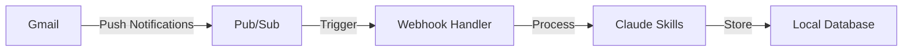
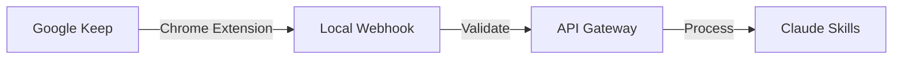
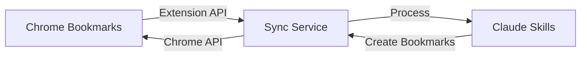
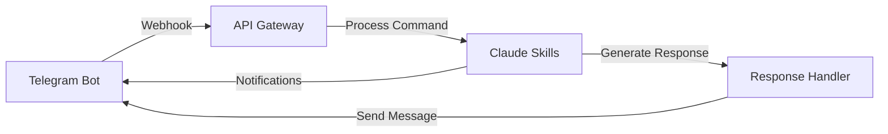
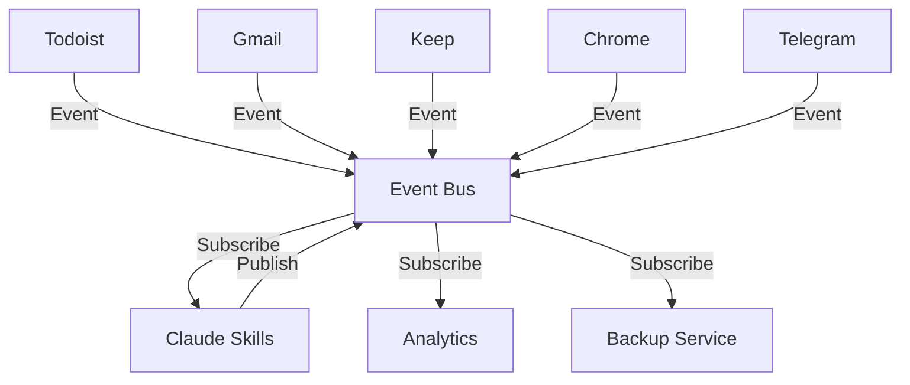
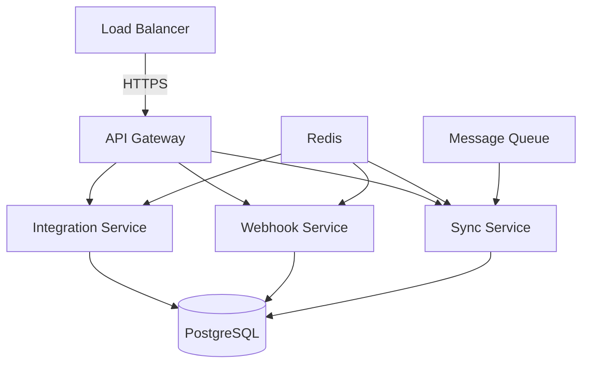

# Life-OS External Tool Integration Architecture

## Overview

This document outlines the integration patterns for connecting Claude Skills with external productivity tools in the life-os ecosystem. Each integration prioritizes security, reliability, and seamless data synchronization.

---

## 1. Todoist Integration

### Purpose
Task management, project tracking, and deadline coordination.

### Available Integration Methods

#### Option A: Todoist REST API (Direct)
- **Authentication**: OAuth 2.0 or API Token
- **Endpoints**:
  - `/tasks` - CRUD operations
  - `/projects` - Project management
  - `/labels` - Tag organization
  - `/comments` - Task discussions

#### Option B: MCP Server (Recommended)
```bash
# Install Todoist MCP server
npm install -g @anthropic/mcp-server-todoist
```

### Credential Management

```typescript
// Environment variables (.env.local)
TODOIST_API_TOKEN=<personal_api_token>
TODOIST_CLIENT_ID=<oauth_client_id>
TODOIST_CLIENT_SECRET=<oauth_client_secret>

// Secure storage location
~/.config/life-os/credentials/todoist.json
```

**Security Best Practices:**
- Store tokens in encrypted keychain (macOS Keychain, Linux Secret Service)
- Never commit credentials to version control
- Use environment-specific tokens (dev/staging/prod)
- Implement token rotation every 90 days
- Use OAuth 2.0 for user-facing applications

### Data Sync Strategy

**Bidirectional Sync:**


**Sync Frequency:**
- Real-time: Webhooks for task updates
- Polling: Every 5 minutes for fallback
- On-demand: User-triggered sync

**Conflict Resolution:**
- Last-write-wins for simple conflicts
- Version vectors for complex scenarios
- User prompt for manual resolution when needed

### Data Flow

```typescript
interface TodoistTask {
  id: string;
  content: string;
  description: string;
  project_id: string;
  labels: string[];
  priority: 1 | 2 | 3 | 4;
  due?: {
    date: string;
    timezone?: string;
  };
  duration?: {
    amount: number;
    unit: "minute" | "hour";
  };
}

// Claude Skills → Todoist
async function createTask(task: TodoistTask): Promise<void> {
  try {
    const response = await todoistClient.tasks.create(task);
    await syncLayer.recordSync('todoist', response.id, 'created');
  } catch (error) {
    await errorHandler.log('todoist', 'create_task', error);
    throw new IntegrationError('Failed to create Todoist task', error);
  }
}

// Todoist → Claude Skills (Webhook)
async function handleWebhook(event: TodoistWebhookEvent): Promise<void> {
  switch (event.event_name) {
    case 'item:added':
      await skillsEngine.importTask(event.event_data);
      break;
    case 'item:updated':
      await skillsEngine.updateTask(event.event_data);
      break;
    case 'item:completed':
      await skillsEngine.completeTask(event.event_data);
      break;
  }
}
```

### Error Handling

```typescript
class TodoistErrorHandler {
  async handle(error: TodoistError): Promise<void> {
    switch (error.status) {
      case 401:
        // Token expired - refresh
        await this.refreshToken();
        break;
      case 429:
        // Rate limit - exponential backoff
        await this.backoff(error.retryAfter);
        break;
      case 503:
        // Service unavailable - queue for retry
        await this.queueForRetry(error.request);
        break;
      default:
        // Log and notify user
        await this.logError(error);
        await this.notifyUser(error);
    }
  }
}
```

---

## 2. Gmail Integration

### Purpose
Email processing, inbox management, and communication tracking.

### Available Integration Methods

#### Option A: Gmail API (Direct)
- **Authentication**: OAuth 2.0 (required)
- **Scopes**:
  - `gmail.readonly` - Read emails
  - `gmail.modify` - Labels and organization
  - `gmail.send` - Send emails

#### Option B: Google Workspace MCP Server (Recommended)
```bash
# Already available via MCP
mcp__google-workspace__search_gmail_messages
mcp__google-workspace__get_gmail_message_content
mcp__google-workspace__send_gmail_message
```

### Credential Management

```typescript
// OAuth 2.0 Flow
GOOGLE_CLIENT_ID=<oauth_client_id>
GOOGLE_CLIENT_SECRET=<oauth_client_secret>
GOOGLE_REDIRECT_URI=http://localhost:3000/auth/google/callback

// Refresh token storage
~/.config/life-os/credentials/google-oauth.json
{
  "access_token": "ya29.xxx",
  "refresh_token": "1//xxx",
  "scope": "https://www.googleapis.com/auth/gmail.modify",
  "token_type": "Bearer",
  "expiry_date": 1234567890000
}
```

**Security Best Practices:**
- Use OAuth 2.0 exclusively (no API keys)
- Request minimum required scopes
- Store tokens encrypted at rest
- Implement automatic token refresh
- Enable 2FA on Google account
- Use service account for automation (when applicable)

### Data Sync Strategy

**One-way Sync (Gmail → Claude Skills):**


**Sync Frequency:**
- Real-time: Gmail Push Notifications (Pub/Sub)
- Polling: Every 15 minutes (fallback)
- On-demand: User-triggered refresh

**Selective Sync:**
- Filter by labels (e.g., "Action Required", "Follow-up")
- Date range filtering (last 30 days)
- Sender/subject filtering

### Data Flow

```typescript
interface EmailMessage {
  id: string;
  threadId: string;
  labelIds: string[];
  snippet: string;
  payload: {
    headers: Array<{ name: string; value: string }>;
    body: { data: string };
  };
  internalDate: string;
}

// Gmail → Claude Skills
async function processEmail(email: EmailMessage): Promise<void> {
  try {
    // Extract metadata
    const from = email.payload.headers.find(h => h.name === 'From')?.value;
    const subject = email.payload.headers.find(h => h.name === 'Subject')?.value;
    const body = Buffer.from(email.payload.body.data, 'base64').toString();

    // Parse for actionable items
    const actions = await aiParser.extractActions(body);

    // Create tasks in Claude Skills
    for (const action of actions) {
      await skillsEngine.createTask({
        title: action.title,
        description: action.description,
        source: 'gmail',
        sourceId: email.id,
        metadata: { from, subject }
      });
    }

    // Apply label
    await gmailClient.modifyLabels(email.id, {
      addLabelIds: ['PROCESSED']
    });
  } catch (error) {
    await errorHandler.log('gmail', 'process_email', error);
  }
}

// Claude Skills → Gmail
async function sendEmail(draft: EmailDraft): Promise<void> {
  const message = createMimeMessage(draft);
  await mcp__google_workspace__send_gmail_message({
    user_google_email: 'user@example.com',
    to: draft.to,
    subject: draft.subject,
    body: draft.body,
    body_format: 'html'
  });
}
```

### Error Handling

```typescript
class GmailErrorHandler {
  async handle(error: GmailError): Promise<void> {
    switch (error.code) {
      case 401:
        // Invalid credentials - reauth required
        await this.triggerReauth();
        break;
      case 403:
        // Rate limit exceeded
        await this.backoff(60000); // 1 minute
        break;
      case 404:
        // Message not found - may be deleted
        await this.handleDeletedMessage(error.messageId);
        break;
      case 503:
        // Backend error - retry with exponential backoff
        await this.retryWithBackoff(error.request);
        break;
      default:
        await this.logAndNotify(error);
    }
  }
}
```

---

## 3. Google Keep Integration

### Purpose
Quick capture, notes, and idea management.

### Available Integration Methods

#### Limitation: No Official API
Google Keep does not provide an official public API. Integration options:

#### Option A: Unofficial Python Library (Keep API)
```bash
pip install keep
# Use with caution - not officially supported
```

#### Option B: Google Tasks API (Alternative)
```bash
# Use Google Tasks as Keep alternative
# Official API with similar functionality
```

#### Option C: Chrome Extension Bridge (Recommended)
- Develop Chrome extension to capture Keep notes
- Extension posts to local webhook
- Webhook forwards to Claude Skills

### Credential Management

```typescript
// For Chrome Extension approach
KEEP_EXTENSION_SECRET=<shared_secret_for_webhook>
KEEP_WEBHOOK_PORT=3001

// For unofficial API (use at own risk)
GOOGLE_KEEP_EMAIL=<email>
GOOGLE_KEEP_PASSWORD=<app_password>  // Use App Password, not main password
```

**Security Best Practices:**
- Chrome extension: Use content security policy
- Webhook: Verify HMAC signature
- App passwords: Store in system keychain
- Consider Google Tasks API as official alternative
- Never store passwords in plaintext

### Data Sync Strategy

**One-way Sync (Keep → Claude Skills):**


**Sync Frequency:**
- On-demand: User clicks "Send to Claude" button
- Manual: Browser extension polls every 30 minutes
- Selective: Only notes with specific label

### Data Flow

```typescript
interface KeepNote {
  id: string;
  title: string;
  content: string;
  labels: string[];
  color: string;
  isPinned: boolean;
  timestamp: string;
  attachments?: Array<{ url: string; type: string }>;
}

// Chrome Extension → Webhook
// Content script in extension
chrome.action.onClicked.addListener(async () => {
  const notes = await chrome.storage.local.get('selectedNotes');

  const signature = await generateHMAC(notes, KEEP_EXTENSION_SECRET);

  await fetch('http://localhost:3001/keep/import', {
    method: 'POST',
    headers: {
      'Content-Type': 'application/json',
      'X-Signature': signature
    },
    body: JSON.stringify(notes)
  });
});

// Webhook Handler
async function handleKeepImport(req: Request): Promise<void> {
  // Verify signature
  const signature = req.headers.get('X-Signature');
  if (!verifyHMAC(req.body, signature, KEEP_EXTENSION_SECRET)) {
    throw new SecurityError('Invalid signature');
  }

  const notes: KeepNote[] = req.body;

  for (const note of notes) {
    await skillsEngine.createNote({
      title: note.title,
      content: note.content,
      tags: note.labels,
      source: 'keep',
      sourceId: note.id,
      metadata: {
        color: note.color,
        isPinned: note.isPinned
      }
    });
  }
}
```

### Error Handling

```typescript
class KeepErrorHandler {
  async handle(error: KeepError): Promise<void> {
    switch (error.type) {
      case 'EXTENSION_NOT_INSTALLED':
        await this.promptInstallExtension();
        break;
      case 'SIGNATURE_INVALID':
        await this.logSecurityIncident(error);
        break;
      case 'NOTE_NOT_FOUND':
        // Note may have been deleted
        await this.handleDeletedNote(error.noteId);
        break;
      default:
        await this.logAndNotify(error);
    }
  }

  private async promptInstallExtension(): Promise<void> {
    console.log('Please install the Life-OS Chrome extension');
    console.log('Download: https://chrome.google.com/webstore/...');
  }
}
```

---

## 4. Chrome Bookmarks Integration

### Purpose
Resource collection, research organization, and reference management.

### Available Integration Methods

#### Option A: Chrome Bookmarks API (Extension)
```javascript
// Chrome Extension API
chrome.bookmarks.getTree()
chrome.bookmarks.search()
chrome.bookmarks.create()
```

#### Option B: Bookmark Export Files
- Export bookmarks as HTML
- Parse and import into Claude Skills
- Schedule periodic exports

#### Option C: Chrome Remote Debugging Protocol
```bash
# Connect to Chrome instance
chrome --remote-debugging-port=9222
# Use Chrome DevTools Protocol
```

### Credential Management

```typescript
// Chrome Extension approach (no credentials needed)
CHROME_EXTENSION_ID=<extension_id>
CHROME_EXTENSION_SECRET=<webhook_secret>

// For remote debugging (local only)
CHROME_DEBUGGING_PORT=9222
```

**Security Best Practices:**
- Extension: Request minimum permissions (`bookmarks` only)
- Webhook: Use HTTPS in production
- Validate all bookmark URLs before storing
- Sanitize HTML content from bookmark descriptions
- Rate limit bookmark imports

### Data Sync Strategy

**Bidirectional Sync:**


**Sync Frequency:**
- Real-time: On bookmark creation/update (via extension)
- Periodic: Full sync every 24 hours
- On-demand: User-triggered sync

### Data Flow

```typescript
interface ChromeBookmark {
  id: string;
  title: string;
  url?: string;
  dateAdded: number;
  dateGroupModified?: number;
  parentId: string;
  children?: ChromeBookmark[];
}

// Chrome → Claude Skills
async function syncBookmarks(): Promise<void> {
  const tree = await chrome.bookmarks.getTree();
  const bookmarks = flattenBookmarkTree(tree[0]);

  for (const bookmark of bookmarks) {
    if (bookmark.url) {
      await skillsEngine.createResource({
        title: bookmark.title,
        url: bookmark.url,
        type: 'bookmark',
        source: 'chrome',
        sourceId: bookmark.id,
        tags: extractTags(bookmark.parentId),
        addedAt: new Date(bookmark.dateAdded)
      });
    }
  }
}

// Claude Skills → Chrome
async function createBookmark(resource: Resource): Promise<void> {
  const folderId = await findOrCreateFolder('Life-OS');

  await chrome.bookmarks.create({
    parentId: folderId,
    title: resource.title,
    url: resource.url
  });
}

// Extension: Listen for bookmark changes
chrome.bookmarks.onCreated.addListener((id, bookmark) => {
  sendToWebhook('bookmark_created', bookmark);
});

chrome.bookmarks.onRemoved.addListener((id, removeInfo) => {
  sendToWebhook('bookmark_removed', { id, removeInfo });
});

chrome.bookmarks.onChanged.addListener((id, changeInfo) => {
  sendToWebhook('bookmark_updated', { id, changeInfo });
});
```

### Error Handling

```typescript
class ChromeBookmarksErrorHandler {
  async handle(error: ChromeError): Promise<void> {
    switch (error.type) {
      case 'PERMISSION_DENIED':
        await this.requestPermission();
        break;
      case 'BOOKMARK_NOT_FOUND':
        // Bookmark deleted in Chrome
        await this.removeFromSkills(error.bookmarkId);
        break;
      case 'INVALID_URL':
        await this.logInvalidUrl(error.url);
        break;
      case 'FOLDER_NOT_FOUND':
        await this.createMissingFolder(error.folderId);
        break;
      default:
        await this.logAndNotify(error);
    }
  }
}
```

---

## 5. Telegram Integration

### Purpose
Communication hub, notifications, and command interface.

### Available Integration Methods

#### Option A: Telegram Bot API (Recommended)
- **Authentication**: Bot Token (from @BotFather)
- **Methods**:
  - `sendMessage` - Send notifications
  - `getUpdates` - Poll for messages
  - Webhooks - Real-time updates

#### Option B: Telegram Client API (MTProto)
- For user account automation
- More complex, requires phone number

### Credential Management

```typescript
// Bot API approach
TELEGRAM_BOT_TOKEN=<bot_token_from_botfather>
TELEGRAM_WEBHOOK_URL=https://your-domain.com/telegram/webhook
TELEGRAM_WEBHOOK_SECRET=<random_secret_token>

// For user notifications
TELEGRAM_USER_ID=<your_numeric_user_id>

// Storage
~/.config/life-os/credentials/telegram.json
{
  "bot_token": "123456:ABC-DEF1234ghIkl-zyx57W2v1u123ew11",
  "webhook_secret": "random_secret_string_here",
  "authorized_users": [123456789, 987654321]
}
```

**Security Best Practices:**
- Never expose bot token publicly
- Use webhook secret to verify requests
- Whitelist authorized user IDs
- Implement rate limiting per user
- Use HTTPS for webhook endpoint
- Validate all incoming commands
- Store tokens in environment variables

### Data Sync Strategy

**Bidirectional Communication:**


**Message Types:**
- Commands: `/task add "Buy groceries"`
- Queries: `/list today`
- Quick capture: Send message to bot
- File uploads: Documents, images, voice notes
- Inline keyboards: Interactive menus

### Data Flow

```typescript
interface TelegramUpdate {
  update_id: number;
  message?: {
    message_id: number;
    from: { id: number; username: string };
    chat: { id: number; type: string };
    text?: string;
    voice?: { file_id: string };
    document?: { file_id: string; file_name: string };
  };
  callback_query?: {
    id: string;
    from: { id: number };
    data: string;
  };
}

// Webhook Handler
async function handleTelegramWebhook(req: Request): Promise<void> {
  // Verify webhook secret
  const token = req.headers.get('X-Telegram-Bot-Api-Secret-Token');
  if (token !== TELEGRAM_WEBHOOK_SECRET) {
    throw new SecurityError('Invalid webhook secret');
  }

  const update: TelegramUpdate = req.body;

  if (update.message?.text) {
    await handleTextMessage(update.message);
  } else if (update.message?.voice) {
    await handleVoiceMessage(update.message);
  } else if (update.callback_query) {
    await handleCallbackQuery(update.callback_query);
  }
}

// Command Processing
async function handleTextMessage(message: TelegramMessage): Promise<void> {
  const userId = message.from.id;

  // Verify authorized user
  if (!isAuthorized(userId)) {
    await sendMessage(userId, 'Unauthorized access. Please contact admin.');
    return;
  }

  const text = message.text;

  if (text.startsWith('/')) {
    // Parse command
    const [command, ...args] = text.slice(1).split(' ');

    switch (command) {
      case 'task':
        await handleTaskCommand(userId, args);
        break;
      case 'list':
        await handleListCommand(userId, args);
        break;
      case 'help':
        await sendHelpMessage(userId);
        break;
      default:
        await sendMessage(userId, `Unknown command: ${command}`);
    }
  } else {
    // Quick capture
    await skillsEngine.createNote({
      content: text,
      source: 'telegram',
      sourceId: message.message_id.toString(),
      createdBy: userId.toString()
    });

    await sendMessage(userId, '✅ Note captured!');
  }
}

// Notifications from Claude Skills → Telegram
async function sendNotification(notification: Notification): Promise<void> {
  const message = formatNotification(notification);

  await bot.sendMessage(TELEGRAM_USER_ID, message, {
    parse_mode: 'Markdown',
    reply_markup: {
      inline_keyboard: [
        [
          { text: '✅ Mark Done', callback_data: `complete:${notification.taskId}` },
          { text: '⏰ Snooze', callback_data: `snooze:${notification.taskId}` }
        ]
      ]
    }
  });
}

// Interactive Callbacks
async function handleCallbackQuery(query: CallbackQuery): Promise<void> {
  const [action, taskId] = query.data.split(':');

  switch (action) {
    case 'complete':
      await skillsEngine.completeTask(taskId);
      await bot.answerCallbackQuery(query.id, { text: '✅ Task completed!' });
      break;
    case 'snooze':
      await skillsEngine.snoozeTask(taskId, 3600); // 1 hour
      await bot.answerCallbackQuery(query.id, { text: '⏰ Snoozed for 1 hour' });
      break;
  }
}
```

### Error Handling

```typescript
class TelegramErrorHandler {
  async handle(error: TelegramError): Promise<void> {
    switch (error.error_code) {
      case 401:
        // Invalid bot token
        await this.notifyAdmin('Invalid Telegram bot token');
        break;
      case 403:
        // Bot blocked by user
        await this.handleBlockedUser(error.userId);
        break;
      case 429:
        // Rate limit exceeded
        await this.backoff(error.retry_after);
        break;
      case 400:
        // Bad request - invalid parameters
        await this.logInvalidRequest(error);
        break;
      default:
        await this.logAndNotify(error);
    }
  }

  private async handleBlockedUser(userId: number): Promise<void> {
    // Remove user from notification list
    await database.update('users', userId, { telegram_notifications: false });
    console.log(`User ${userId} blocked the bot`);
  }
}
```

---

## Unified Integration Architecture

### Central Sync Layer

```typescript
class IntegrationHub {
  private adapters: Map<string, IntegrationAdapter> = new Map();

  constructor() {
    this.adapters.set('todoist', new TodoistAdapter());
    this.adapters.set('gmail', new GmailAdapter());
    this.adapters.set('keep', new KeepAdapter());
    this.adapters.set('chrome', new ChromeAdapter());
    this.adapters.set('telegram', new TelegramAdapter());
  }

  async syncAll(): Promise<void> {
    const results = await Promise.allSettled(
      Array.from(this.adapters.values()).map(adapter => adapter.sync())
    );

    results.forEach((result, index) => {
      if (result.status === 'rejected') {
        console.error(`Sync failed for ${Array.from(this.adapters.keys())[index]}:`, result.reason);
      }
    });
  }

  async handleEvent(source: string, event: Event): Promise<void> {
    const adapter = this.adapters.get(source);
    if (!adapter) {
      throw new Error(`Unknown source: ${source}`);
    }

    await adapter.handleEvent(event);
  }
}
```

### Event Bus Architecture



```typescript
class EventBus {
  private subscribers: Map<string, Set<EventHandler>> = new Map();

  subscribe(eventType: string, handler: EventHandler): void {
    if (!this.subscribers.has(eventType)) {
      this.subscribers.set(eventType, new Set());
    }
    this.subscribers.get(eventType)!.add(handler);
  }

  async publish(event: IntegrationEvent): Promise<void> {
    const handlers = this.subscribers.get(event.type) || new Set();

    await Promise.all(
      Array.from(handlers).map(handler =>
        handler(event).catch(error => {
          console.error(`Handler failed for ${event.type}:`, error);
        })
      )
    );
  }
}
```

### Credential Vault

```typescript
class CredentialVault {
  private keychain: Keychain;

  async store(service: string, credential: Credential): Promise<void> {
    const encrypted = await this.encrypt(credential);
    await this.keychain.setPassword(service, 'default', encrypted);
  }

  async retrieve(service: string): Promise<Credential> {
    const encrypted = await this.keychain.getPassword(service, 'default');
    return this.decrypt(encrypted);
  }

  private async encrypt(data: any): Promise<string> {
    // Use system keychain encryption
    return this.keychain.encrypt(JSON.stringify(data));
  }

  private async decrypt(encrypted: string): Promise<any> {
    const decrypted = await this.keychain.decrypt(encrypted);
    return JSON.parse(decrypted);
  }
}
```

---

## Security Considerations

### Authentication Security Matrix

| Service | Auth Method | Token Storage | Rotation | 2FA Support |
|---------|-------------|---------------|----------|-------------|
| Todoist | API Token / OAuth | Keychain | 90 days | Yes |
| Gmail | OAuth 2.0 | Encrypted file | Auto | Required |
| Keep | App Password | Keychain | 180 days | Yes |
| Chrome | Extension API | None needed | N/A | N/A |
| Telegram | Bot Token | Environment | Never | N/A |

### Data Privacy

1. **Encryption at Rest**
   - All credentials encrypted using system keychain
   - Database encryption for sensitive content
   - File-level encryption for backups

2. **Encryption in Transit**
   - HTTPS/TLS 1.3 for all API calls
   - Webhook endpoints require HTTPS
   - Local connections can use HTTP

3. **Data Minimization**
   - Store only necessary metadata
   - Configurable retention policies
   - Automatic cleanup of old data

4. **Access Control**
   - User-specific API tokens
   - Service-specific permissions
   - Audit logging for all operations

### Network Security

```typescript
// API Client with security features
class SecureApiClient {
  private retryDelay = 1000;
  private maxRetries = 3;

  async request(config: RequestConfig): Promise<Response> {
    // Add security headers
    const headers = {
      ...config.headers,
      'User-Agent': 'Life-OS/1.0',
      'X-Request-ID': generateRequestId(),
    };

    // Implement retry with exponential backoff
    for (let i = 0; i < this.maxRetries; i++) {
      try {
        const response = await fetch(config.url, {
          ...config,
          headers,
          signal: AbortSignal.timeout(30000) // 30s timeout
        });

        if (response.ok) {
          return response;
        }

        if (response.status === 429) {
          // Rate limited - wait and retry
          await this.sleep(this.retryDelay * Math.pow(2, i));
          continue;
        }

        throw new ApiError(response.status, await response.text());
      } catch (error) {
        if (i === this.maxRetries - 1) throw error;
        await this.sleep(this.retryDelay * Math.pow(2, i));
      }
    }
  }

  private sleep(ms: number): Promise<void> {
    return new Promise(resolve => setTimeout(resolve, ms));
  }
}
```

---

## Deployment Architecture

### Development Environment

```yaml
# docker-compose.yml
version: '3.8'

services:
  life-os:
    build: .
    ports:
      - "3000:3000"
    environment:
      - NODE_ENV=development
      - TODOIST_API_TOKEN=${TODOIST_API_TOKEN}
      - GOOGLE_CLIENT_ID=${GOOGLE_CLIENT_ID}
      - TELEGRAM_BOT_TOKEN=${TELEGRAM_BOT_TOKEN}
    volumes:
      - ./src:/app/src
      - ~/.config/life-os:/root/.config/life-os:ro

  webhook-relay:
    image: ngrok/ngrok
    command: http life-os:3000
    environment:
      - NGROK_AUTHTOKEN=${NGROK_AUTHTOKEN}
```

### Production Deployment



### Monitoring & Observability

```typescript
// Metrics collection
class IntegrationMetrics {
  private prometheus: PrometheusClient;

  recordSync(service: string, duration: number, success: boolean): void {
    this.prometheus.histogram('integration_sync_duration', {
      service,
      success: success.toString()
    }).observe(duration);
  }

  recordApiCall(service: string, endpoint: string, status: number): void {
    this.prometheus.counter('integration_api_calls', {
      service,
      endpoint,
      status: status.toString()
    }).inc();
  }

  recordError(service: string, errorType: string): void {
    this.prometheus.counter('integration_errors', {
      service,
      type: errorType
    }).inc();
  }
}

// Health checks
async function checkIntegrationHealth(): Promise<HealthStatus> {
  const services = ['todoist', 'gmail', 'telegram'];
  const results = await Promise.all(
    services.map(async service => ({
      service,
      healthy: await checkServiceHealth(service)
    }))
  );

  return {
    overall: results.every(r => r.healthy),
    services: results
  };
}
```

---

## Implementation Roadmap

### Phase 1: Core Integrations (Week 1-2)
- ✅ Todoist integration (MCP or direct API)
- ✅ Gmail integration (Google Workspace MCP)
- ✅ Telegram bot setup and commands

### Phase 2: Extension Development (Week 3-4)
- ✅ Chrome bookmarks extension
- ✅ Keep capture extension
- ✅ Webhook infrastructure

### Phase 3: Sync & Reliability (Week 5-6)
- ✅ Event bus implementation
- ✅ Conflict resolution
- ✅ Error handling and retry logic

### Phase 4: Security Hardening (Week 7-8)
- ✅ Credential vault
- ✅ Token rotation
- ✅ Audit logging

### Phase 5: Production Deployment (Week 9-10)
- ✅ Docker containerization
- ✅ CI/CD pipeline
- ✅ Monitoring and alerting

---

## Testing Strategy

### Integration Tests

```typescript
describe('Todoist Integration', () => {
  it('should create task in Todoist', async () => {
    const task = await skillsEngine.createTask({
      title: 'Test task',
      project: 'Inbox'
    });

    const todoistTask = await todoistClient.getTask(task.sourceId);
    expect(todoistTask.content).toBe('Test task');
  });

  it('should handle webhook events', async () => {
    const webhook = createMockWebhook('item:completed', mockTask);
    await handleTodoistWebhook(webhook);

    const task = await skillsEngine.getTask(mockTask.id);
    expect(task.status).toBe('completed');
  });
});

describe('Gmail Integration', () => {
  it('should extract actionable items from email', async () => {
    const email = createMockEmail({
      subject: 'Meeting tomorrow',
      body: 'Please prepare the Q4 report'
    });

    await processEmail(email);

    const tasks = await skillsEngine.getTasks({ source: 'gmail' });
    expect(tasks).toHaveLength(1);
    expect(tasks[0].title).toContain('Q4 report');
  });
});
```

### End-to-End Tests

```typescript
describe('Cross-Integration Workflow', () => {
  it('should sync task from Telegram to Todoist', async () => {
    // Send message via Telegram
    await bot.sendMessage('/task add "Buy groceries"');

    // Wait for sync
    await wait(2000);

    // Check task in Todoist
    const tasks = await todoistClient.getTasks();
    expect(tasks.find(t => t.content === 'Buy groceries')).toBeDefined();
  });
});
```

---

## Conclusion

This architecture provides:

1. **Secure Credential Management**: System keychain integration, OAuth 2.0, token rotation
2. **Reliable Data Sync**: Event-driven architecture, conflict resolution, retry logic
3. **Comprehensive Error Handling**: Service-specific handlers, graceful degradation
4. **Scalable Design**: Event bus, message queue, microservices-ready
5. **Developer Experience**: Clear APIs, extensive documentation, testing utilities

All integrations follow security best practices and provide seamless data flow between external tools and Claude Skills.
