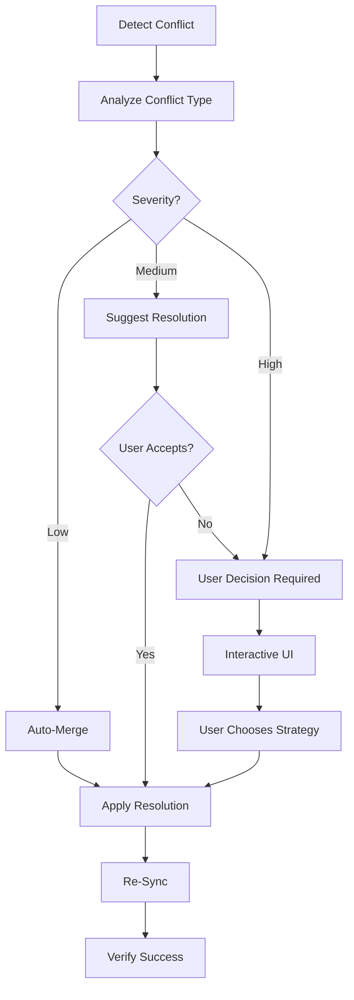

# Resolving Sync Conflicts

## Overview
Handle synchronization conflicts between local Life OS data and remote Todoist data when both have been modified.

## When to Use
- After bi-directional sync detects conflicting changes
- When local and remote versions of a task differ
- Before overwriting any user data
- When merge strategy is unclear

## Conflict Types

### 1. Title Conflict
- **Local**: "Buy groceries for dinner party"
- **Remote**: "Buy groceries"
- **Cause**: Title edited in both places

### 2. Due Date Conflict
- **Local**: "2025-10-25"
- **Remote**: "2025-10-27"
- **Cause**: Due date changed in both systems

### 3. Status Conflict
- **Local**: Completed (checked off locally)
- **Remote**: Active (still open in Todoist)
- **Cause**: Status changed in both places

### 4. Priority Conflict
- **Local**: Priority 1 (high)
- **Remote**: Priority 3 (low)
- **Cause**: Priority adjusted differently

### 5. Project/Context Conflict
- **Local**: Moved to "Work" project
- **Remote**: Moved to "Personal" project
- **Cause**: Organization changed in both systems

### 6. Content Conflict
- **Local**: "Call dentist - schedule cleaning"
- **Remote**: "Call dentist - emergency appointment"
- **Cause**: Task content diverged

## Resolution Strategies

### 1. Keep Local (User's Changes Win)
```typescript
// User's recent edits take priority
// Overwrite remote with local version
// Use when: User explicitly modified locally and wants to keep it
```

### 2. Keep Remote (Todoist Wins)
```typescript
// Remote Todoist data takes priority
// Overwrite local with remote version
// Use when: Remote is more authoritative or user prefers Todoist version
```

### 3. Merge Both (Combine Changes)
```typescript
// Intelligently combine both versions
// Use when: Changes are complementary, not contradictory
// Example: Merge title additions, combine tags
```

### 4. Manual Edit
```typescript
// Let user manually resolve
// Present both versions side-by-side
// User creates final merged version
// Use when: Automatic merge would lose data
```

### 5. Skip/Defer
```typescript
// Don't resolve now, ask later
// Log conflict for future resolution
// Use when: User wants to decide later
```

## Detection Process

```typescript
interface ConflictDetectionFlow {
  step1: "Compare local and remote timestamps"
  step2: "Check if both modified since last sync"
  step3: "Compare field values (title, date, status, etc.)"
  step4: "Identify conflict type and severity"
  step5: "Generate conflict report"
}
```

## Resolution Flow



## Interactive Resolution UI

### Conflict Presentation
```
╔════════════════════════════════════════════════════════════╗
║ SYNC CONFLICT DETECTED                                     ║
╠════════════════════════════════════════════════════════════╣
║ Task: "Buy groceries"                                      ║
║ Conflict Type: TITLE + DUE_DATE                           ║
║ Last Synced: 2025-10-19 14:30                             ║
╠════════════════════════════════════════════════════════════╣
║ LOCAL (Your Changes)          REMOTE (Todoist)            ║
║ ──────────────────────────────────────────────────────     ║
║ Title: "Buy groceries for     Title: "Buy groceries"      ║
║        dinner party"                                       ║
║ Due: 2025-10-25               Due: 2025-10-27             ║
║ Modified: 2 hours ago         Modified: 1 hour ago        ║
╠════════════════════════════════════════════════════════════╣
║ Resolution Options:                                        ║
║ [1] Keep Local (your changes win)                         ║
║ [2] Keep Remote (Todoist wins)                            ║
║ [3] Merge Both (combine changes)                          ║
║ [4] Manual Edit (edit directly)                           ║
║ [5] Skip (decide later)                                   ║
╚════════════════════════════════════════════════════════════╝
```

### Resolution Confirmation
```
╔════════════════════════════════════════════════════════════╗
║ RESOLUTION PREVIEW                                         ║
╠════════════════════════════════════════════════════════════╣
║ Selected Strategy: Merge Both                              ║
║                                                            ║
║ Final Version:                                             ║
║ ──────────────────────────────────────────────────────     ║
║ Title: "Buy groceries for dinner party"                   ║
║ Due: 2025-10-25                                           ║
║ Priority: 2                                               ║
║ Project: Personal                                         ║
╠════════════════════════════════════════════════════════════╣
║ This will:                                                 ║
║ ✓ Update Todoist with merged version                      ║
║ ✓ Update local database                                   ║
║ ✓ Mark conflict as resolved                               ║
║                                                            ║
║ Continue? [Y/n]                                           ║
╚════════════════════════════════════════════════════════════╝
```

## Implementation Steps

### 1. Detect Conflicts
```bash
# During bi-directional sync
1. Load local tasks from database
2. Fetch remote tasks from Todoist
3. Compare timestamps and content
4. Generate conflict list
```

### 2. Present Conflicts
```bash
# Show user what conflicts exist
1. Format conflict details
2. Display side-by-side comparison
3. Highlight differences
4. Explain conflict severity
```

### 3. Get User Choice
```bash
# Interactive prompt
1. Show resolution options
2. Get user selection
3. Validate choice
4. Confirm before applying
```

### 4. Apply Resolution
```bash
# Execute chosen strategy
1. Create merged version
2. Update local database
3. Push to Todoist
4. Mark conflict as resolved
5. Log resolution decision
```

### 5. Verify & Continue
```bash
# Ensure clean state
1. Verify sync successful
2. Update sync timestamps
3. Continue with remaining tasks
4. Generate conflict report
```

## Conflict Severity Levels

### Low Severity (Auto-Merge Safe)
- Non-conflicting field changes (title local, date remote)
- Tag additions on both sides
- Complementary note additions
- Priority changes that don't conflict

**Strategy**: Auto-merge with notification

### Medium Severity (Suggest Resolution)
- Same field changed differently (title changed on both)
- Due date moved to different days
- Project/context changed differently
- Recoverable data loss

**Strategy**: Suggest best resolution, allow override

### High Severity (User Decision Required)
- Status conflicts (completed vs active)
- Contradictory content changes
- Multiple fields in conflict
- Data loss would occur with any auto-merge

**Strategy**: Require explicit user choice

## Merge Strategies by Conflict Type

### Title Conflicts
- **Auto-Merge**: If one is substring of other, use longer
- **Manual**: If completely different content

### Due Date Conflicts
- **Auto-Merge**: Use earlier date (more urgent)
- **Manual**: If dates differ by >3 days, ask user

### Status Conflicts
- **Never Auto-Merge**: Always ask user
- **Reason**: Status is critical state change

### Priority Conflicts
- **Auto-Merge**: Use higher priority (more important)
- **Manual**: If priorities are equal, ask user

### Project/Context Conflicts
- **Auto-Merge**: Keep most recent organization
- **Manual**: If moving between major categories (work/personal)

### Content Conflicts
- **Never Auto-Merge**: Content divergence needs review
- **Manual**: Show diff and let user merge

## Conflict Prevention

### Best Practices
1. **Sync frequently**: Reduce divergence window
2. **One source of truth**: Make primary edits in one place
3. **Review before sync**: Check what will sync
4. **Use conflict log**: Learn from past conflicts

### Configuration Options
```typescript
interface ConflictSettings {
  autoMergeLowSeverity: boolean; // Auto-merge safe conflicts
  promptBeforeOverwrite: boolean; // Always confirm
  keepConflictLog: boolean; // Log all conflicts
  defaultStrategy: 'local' | 'remote' | 'prompt'; // Fallback
}
```

## Conflict Logging

### Log Entry Format
```typescript
interface ConflictLog {
  timestamp: Date;
  taskId: string;
  taskTitle: string;
  conflictType: ConflictType[];
  localValue: any;
  remoteValue: any;
  chosenStrategy: ResolutionStrategy;
  finalValue: any;
  autoResolved: boolean;
  userNotes?: string;
}
```

### Uses for Conflict Log
- Review past decisions
- Identify problematic patterns
- Train better auto-merge rules
- Audit data changes
- Dispute resolution

## Error Handling

### If Resolution Fails
1. **Rollback**: Restore pre-resolution state
2. **Log error**: Record failure details
3. **Retry option**: Let user try again
4. **Skip option**: Defer resolution
5. **Manual sync**: Fall back to one-way sync

### Safety Guarantees
- Never lose local data without confirmation
- Never overwrite recent changes without warning
- Always show what will change before applying
- Allow undo of recent resolutions
- Keep backup of pre-resolution state

## Testing Conflict Resolution

### Test Scenarios
1. Create task locally, edit remotely, sync
2. Complete task locally, still active remotely
3. Change due date in both places
4. Move task to different projects
5. Edit title and content simultaneously
6. Delete locally, edit remotely
7. Multiple fields in conflict

### Validation
- All conflicts detected correctly
- User can resolve all conflict types
- Resolution applies correctly
- No data loss occurs
- Sync continues after resolution

## Integration with Sync Process

```typescript
async function syncWithConflictResolution() {
  // 1. Attempt bi-directional sync
  const syncResult = await bidirectionalSync();

  // 2. Check for conflicts
  if (syncResult.conflicts.length > 0) {
    console.log(`⚠️  ${syncResult.conflicts.length} conflicts detected`);

    // 3. Resolve each conflict
    for (const conflict of syncResult.conflicts) {
      const resolution = await resolveConflict(conflict);
      await applyResolution(conflict, resolution);
    }

    // 4. Re-sync after resolutions
    await bidirectionalSync();
  }

  console.log('✅ Sync complete with all conflicts resolved');
}
```

## Success Criteria

✅ All conflict types detected accurately
✅ User can choose resolution strategy
✅ Resolution applies correctly to both local and remote
✅ No data loss during conflict resolution
✅ Sync continues successfully after resolution
✅ Conflict log maintained for audit
✅ Clear UI shows what conflicts exist
✅ Safe defaults prevent accidental overwrites

## Example Usage

```bash
# Sync and handle conflicts
npm run sync -- --resolve-conflicts

# View conflict log
npm run sync:conflicts -- --log

# Configure conflict resolution
npm run sync:configure -- --conflict-strategy=prompt

# Test conflict resolution
npm run test:conflicts
```

## Advanced Features

### Conflict Prediction
- Analyze sync patterns
- Warn before likely conflicts
- Suggest best time to sync

### Smart Auto-Merge
- Learn from user decisions
- Train conflict resolution rules
- Reduce manual interventions

### Batch Conflict Resolution
- Resolve multiple conflicts at once
- Apply same strategy to similar conflicts
- Faster resolution for many conflicts

## Resources

- Conflict detection algorithm: `/src/utils/conflict-detector.ts`
- Interactive UI: `/src/utils/conflict-ui.ts`
- Resolution strategies: `/src/services/conflict-resolver.ts`
- Test scenarios: `/tests/conflicts/scenarios.test.ts`
